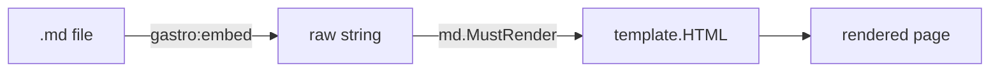

# Rendering markdown in Gastro

Gastro doesn't ship a markdown renderer. The framework gives you a
codegen-time directive that bakes file contents into a Go variable —
`//gastro:embed` — and you decide how to render the result.

This page shows the canonical patterns for static content (the most
common case), dynamic content loaded by URL slug, and a 30-line
copy-pasteable renderer that wires goldmark + chroma the way the
in-tree `examples/gastro` website does.

## Why no built-in helper?

Different projects want different markdown stacks: GFM with footnotes,
CommonMark with custom AST passes, Markdown-It-style options,
math/Mermaid extensions, syntax-highlighting themes. Picking one
flavour for everyone makes Gastro heavier and less flexible. The
framework's job is to get the bytes from disk into your handler; the
30 lines that turn those bytes into HTML belong in your codebase
where you can tune them freely.

The practical effect: a fresh Gastro project's `go.mod` carries no
markdown dependencies. They live in your code (or not at all, if your
content is HTML to begin with).

## The renderer (copy this into your project)

Drop this in `md/md.go` (or anywhere you like) and modify to taste:

```go
// Package md renders markdown to HTML. Modify the goldmark options
// for a different flavour or highlighter.
package md

import (
	"bytes"
	"fmt"
	"html/template"

	chromahtml "github.com/alecthomas/chroma/v2/formatters/html"
	"github.com/yuin/goldmark"
	"github.com/yuin/goldmark/extension"
	highlighting "github.com/yuin/goldmark-highlighting/v2"
)

var renderer = goldmark.New(
	goldmark.WithExtensions(
		extension.GFM,
		extension.Footnote,
		highlighting.NewHighlighting(
			highlighting.WithStyle("github"),
			highlighting.WithFormatOptions(chromahtml.WithClasses(true)),
		),
	),
)

func MustRender(src string) template.HTML {
	h, err := Render(src)
	if err != nil {
		panic(fmt.Errorf("md: %w", err))
	}
	return h
}

func Render(src string) (template.HTML, error) {
	var buf bytes.Buffer
	if err := renderer.Convert([]byte(src), &buf); err != nil {
		return "", err
	}
	return template.HTML(buf.String()), nil
}
```

Add the deps once to your project:

```sh
go get github.com/yuin/goldmark github.com/yuin/goldmark-highlighting/v2 github.com/alecthomas/chroma/v2
```

That's the entire markdown story for static-content sites.

## Mermaid diagrams

This example site renders fenced ` ```mermaid ` blocks as flowcharts
and sequence diagrams using [mermaid.js](https://mermaid.js.org/). A
small extension lives next to the renderer in
[`md/mermaid.go`](https://github.com/andrioid/gastro/blob/main/examples/gastro/md/mermaid.go);
the SSE doc has a [live example](/docs/sse#sse-from-page-the-headline)
of the GET/POST page lifecycle as a flowchart.

The pattern is small enough to copy verbatim and zero new Go
dependencies are required — it composes the same `goldmark`,
`goldmark/ast`, `goldmark/parser`, `goldmark/renderer`, `goldmark/text`
and `goldmark/util` packages that goldmark-highlighting already pulls
in. Two pieces wired together:

1. **Parser-stage AST transformer.** Walks the parsed tree and replaces
   every `*ast.FencedCodeBlock` whose info string is `mermaid` with a
   custom `mermaidBlock` AST node. Running at the parser stage — not as
   a higher-priority node renderer — means goldmark-highlighting's
   chroma renderer never sees these nodes, so we don't have to fight
   the highlighter's registry or re-implement code-block rendering.
2. **Custom node renderer.** Emits the raw mermaid source (HTML-escaped)
   inside `<pre class="mermaid">…</pre>`. mermaid.js' default scanner
   picks up that selector and swaps the element for an SVG diagram on
   first paint.

Wire it into your goldmark instance alongside the highlighter:

```go
var renderer = goldmark.New(
    goldmark.WithExtensions(
        extension.GFM,
        extension.Footnote,
        highlighting.NewHighlighting(/* ... */),
        md.NewMermaid(), // ```mermaid → <pre class="mermaid">
    ),
)
```

For the client side, lazy-load mermaid.js only when a diagram is
actually present on the page. This keeps mermaid's ~600KB off every
page that doesn't need it. Add this once near the bottom of your
base layout:

```html
<script>
    if (document.querySelector('pre.mermaid')) {
        import('https://cdn.jsdelivr.net/npm/mermaid@11/dist/mermaid.esm.min.mjs')
            .then(({ default: mermaid }) => {
                mermaid.initialize({ startOnLoad: false, securityLevel: 'strict' });
                mermaid.run({ querySelector: 'pre.mermaid' });
            });
    }
</script>
```

Use it from any markdown file:

````md

````

This renders to a flowchart on first paint, while sibling code blocks
such as ` ```go ` continue to flow through chroma untouched.

The same shape — *parser AST transformer + custom node kind +
minimal node renderer* — generalises to other diagram or DSL
extensions you might want (KaTeX math, GraphViz, custom admonitions).
When one fits your project, copy `md/mermaid.go` and adjust the
language string and rendered wrapper.

### Trust boundary

Everything inside ` ```mermaid ` ends up as text that mermaid.js
parses in the browser. The renderer HTML-escapes the source so any
stray `<script>` in the diagram's labels can't break out and execute,
and the loader configures `securityLevel: 'strict'` so mermaid itself
strips dangerous markup from labels before rendering. If you accept
user-submitted markdown that may contain diagrams, that escape +
strict combo is the floor; consider also rendering server-side with
[mermaid-cli](https://github.com/mermaid-js/mermaid-cli) if you want
to avoid running mermaid in untrusted browsers altogether.

## Static markdown — the canonical case

Most sites have markdown files committed to the repo: documentation
pages, an About blurb, marketing copy. For these, `//gastro:embed`
bakes the bytes at codegen time and your renderer runs once at
process init.

```gastro
---
import "yourapp/md"

//gastro:embed about.md
var aboutRaw string
var about = md.MustRender(aboutRaw)
---
<article class="prose">
  {{ .about }}
</article>
```

What happens:

1. `gastro generate` reads `about.md` (relative to the `.gastro`
   source) and rewrites the directive into
   `var aboutRaw = "<file contents as a Go string literal>"`.
2. The frontmatter hoister lifts both `aboutRaw` and `about` to
   package scope. `md.MustRender` runs once when the package is
   first imported — typically at process startup.
3. Per-request handler code does nothing markdown-related: it just
   reads the package-scope `about` and writes it to the response.

### Directive contract

```
//gastro:embed PATH
var <ident> string   // or []byte
```

- `PATH` is resolved relative to the `.gastro` source file's
  directory.
- `PATH` must remain inside your Go module after path resolution
  (i.e. inside the directory containing `go.mod`). For monorepo
  layouts where you need to embed shared content owned by a parent
  module, place a symlink inside your module pointing out — symlinks
  are followed even when their target sits outside the module
  (you opt in by creating the symlink).
- The var must be declared on the line *immediately* below the
  directive — no blank line between them, just like `//go:embed`.
- Var type must be `string` or `[]byte`. `template.HTML`, `any`, and
  named types are rejected.
- The var must have no initializer (the directive provides the
  value). Parenthesized var groups (`var ( A string; B string )`)
  and multi-name specs (`var A, B string`) are rejected.
- Bytes are preserved exactly — no trailing-newline stripping or
  whitespace normalization. Matches `//go:embed` semantics.

### Two foot-guns to know about

**Per-request waste.** In frontmatter, `var X = md.Render(...)` is
hoisted to package scope and runs once. `X := md.Render(...)` is
local to the per-request handler and runs *every request*. For
static content always use `var =`.

**Init-time panic.** `var X = md.MustRender(...)` runs at process
init. If the embedded `.md` is malformed, the binary will panic on
startup with no graceful recovery — your deploy fails before the
first request lands. This is usually what you want (fail fast,
don't ship broken content), but it makes a `go build` + smoke test
in CI essential. Run `go tool gastro check` and a `go build ./...`
in CI to catch regressions before they reach prod. For dynamic
content where a render failure should produce a 500 rather than
panic, use the non-Must `Render` and handle the error.

**LSP quick-fix for the var-type error.** Editors with LSP support
will surface a lightbulb on the `var of type \`string\` or \`[]byte\``
squiggle. Choosing it rewrites the type in place — useful when you
meant `string` but typed `template.HTML` or vice versa.

## Dynamic markdown — slugs, databases, etc.

For content the user picks at request time (e.g. a blog with hundreds
of posts where you don't want every post embedded into the binary),
read in the handler and pass the same renderer:

```gastro
---
import (
	"embed"
	"net/http"
	"yourapp/md"
)

//go:embed posts/*.md
var posts embed.FS

slug := r.PathValue("slug")
raw, err := posts.ReadFile("posts/" + slug + ".md")
if err != nil {
	http.NotFound(w, r)
	return
}
html, err := md.Render(string(raw))
if err != nil {
	http.Error(w, err.Error(), http.StatusInternalServerError)
	return
}
---
<article class="prose">
  {{ .html }}
</article>
```

Notes:

- The `.gastro` file lives at `pages/blog/[slug].gastro`. Gastro's
  router gives you `r.PathValue("slug")` for free.
- We use Go's `//go:embed` (note: standard Go directive, not
  `//gastro:embed`) for the FS so all posts ship inside the binary
  but only the requested one is read per request.
- `md.Render` (not `MustRender`) lets us turn render errors into HTTP
  500s instead of crashing.
- The same `md.Render` function handles both static (`var X =
  md.MustRender(staticRaw)`) and dynamic cases. No framework helper
  required.

For database-backed content, swap the `posts.ReadFile` call for a
DB query that returns the markdown source. The renderer doesn't
care where the bytes came from.

## Mental model

| Source of markdown | Where bytes come from | Where rendering happens |
| --- | --- | --- |
| Static, in repo | `//gastro:embed PATH` (codegen-time bake) | `var X = md.MustRender(rawX)` (process init) |
| Static, but lots of files | `//go:embed posts/*.md` + per-request lookup | `md.Render(...)` per request |
| Dynamic from DB | DB query in frontmatter | `md.Render(...)` per request |

The framework provides `//gastro:embed` (codegen-time), routing,
ambient `(w, r)`, and the `var`-hoisting pass that lets package-scope
declarations in frontmatter run once. The user provides storage and
the renderer.

## Caching dynamic renders

If a popular blog post is rendered thousands of times per day, the
goldmark conversion adds up. Wrap the renderer in an LRU cache (e.g.
`hashicorp/golang-lru`) keyed by post ID. The framework doesn't ship
caching because the right key (slug? hash of source? per-tenant?) is
project-specific.

## When to reach for a runtime helper sub-module

There isn't one yet. If your use case doesn't fit the patterns on
this page, file an issue — a `github.com/andrioid/gastro/md`
sub-module is on the table when a real need surfaces, but shipping
it pre-emptively forces a markdown stack on every consumer for
benefits the 30-line copy-paste already provides.
